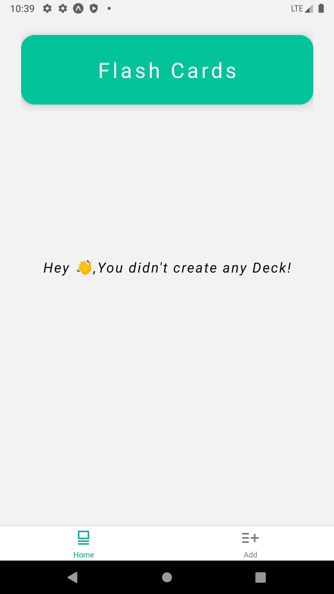
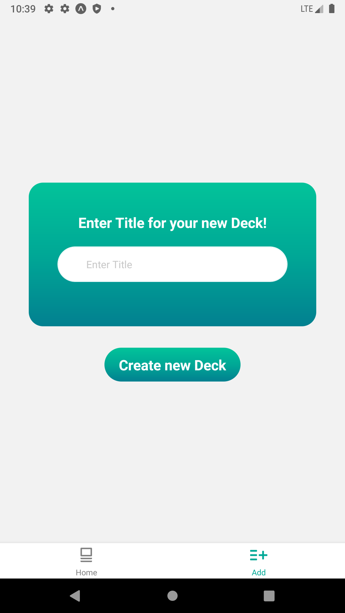
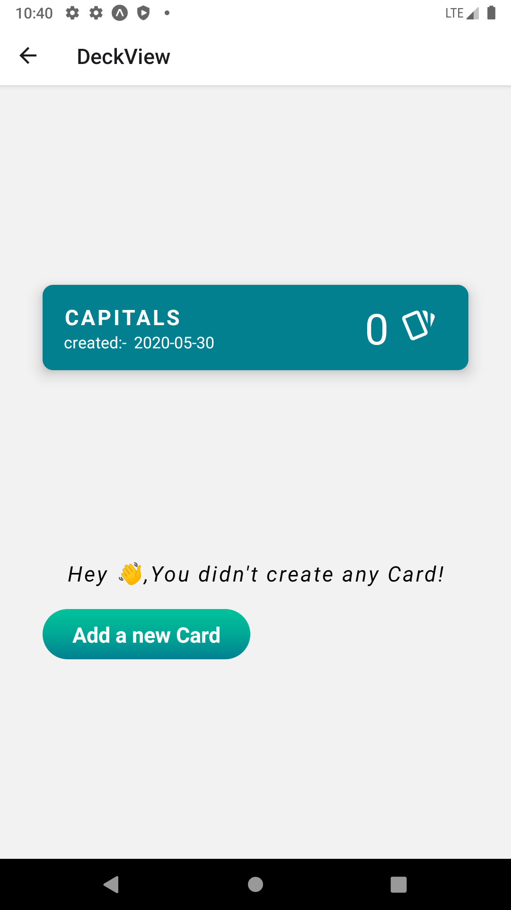
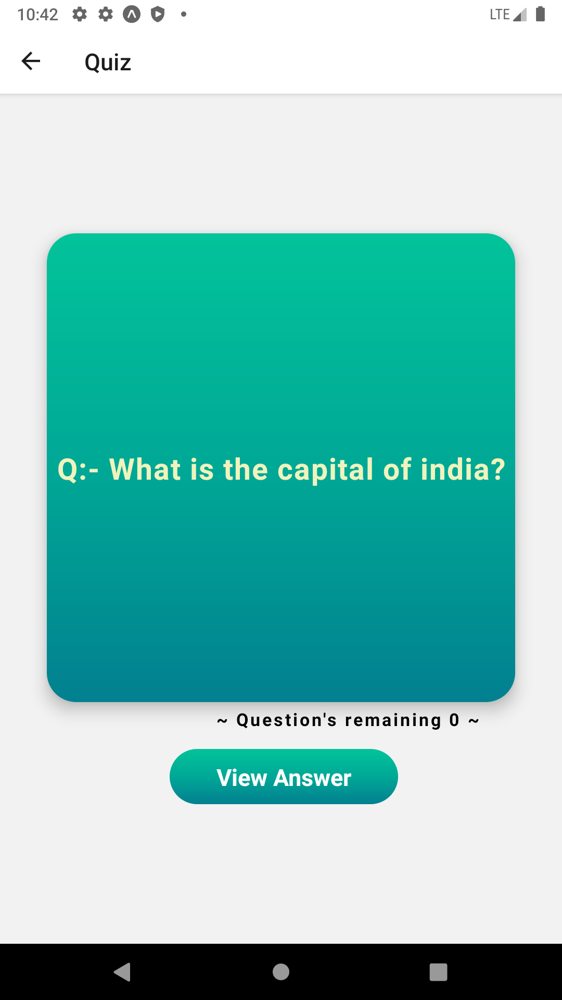
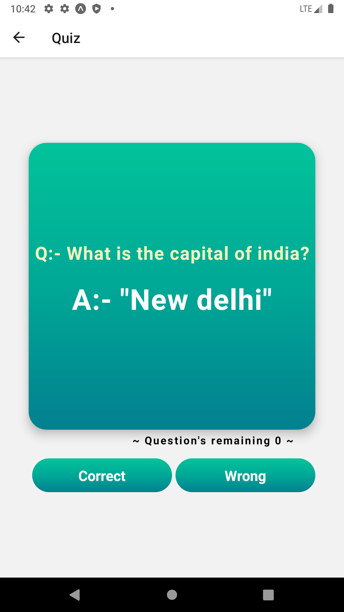
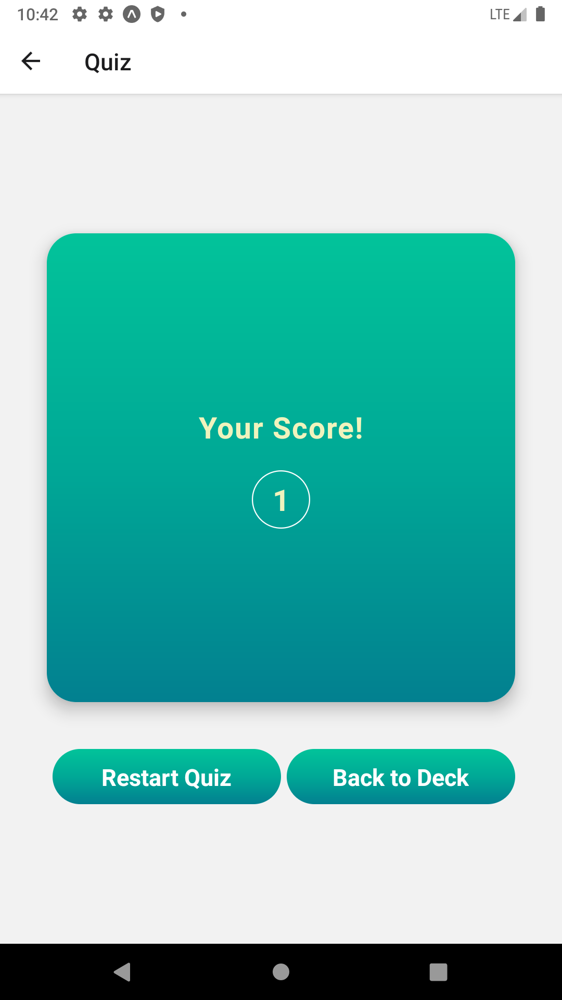
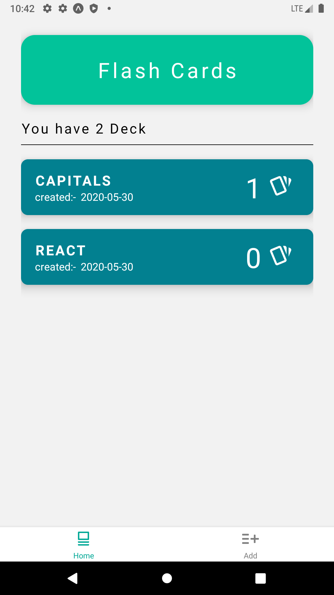
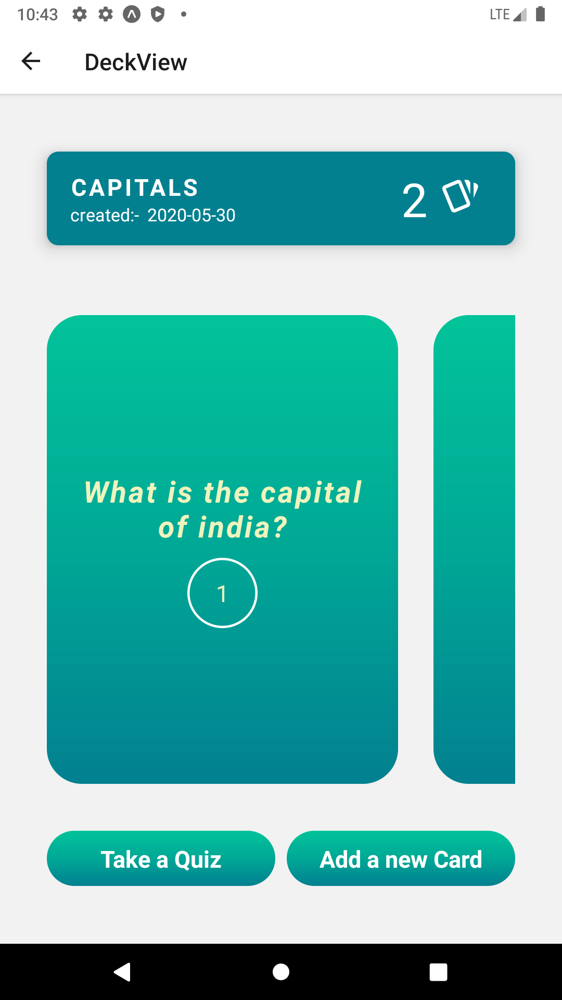

# Mobile Flashcards App

The Mobile Flashcards Project is a part of the Udacity React Nanodegree.
The Mobile Flashcards app allows you to create decks of flashcards which you can use to study for tests. 

## System Requirements

* NODE
* EXPO-CLI
* REACT-NATIVE
* YARN 

## How to run the app
To run the app, follow the steps below:

* Run `yarn install`
* Run `yarn start`
* Use [Expo](https://expo.io/) to run the app on an iOS or Android simulator

## Device Support
The app has been tested on the following devices:

 - NEXUS 2
 - Android Simulator
 
 ## Device Support
 
 
 
 
 
 
 
 
 
 
 
 
 
 
 
 
 
 
 
